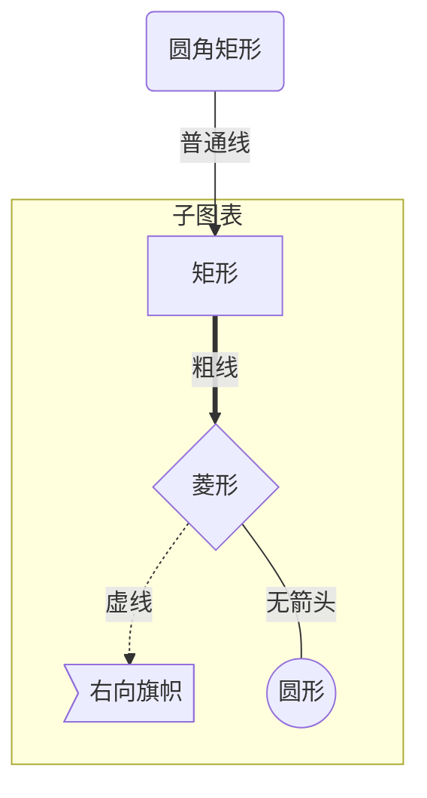
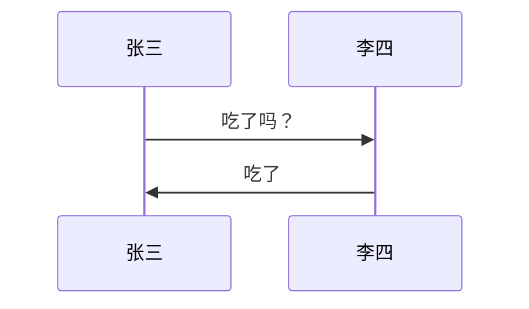
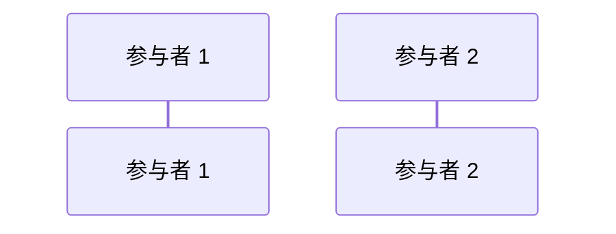
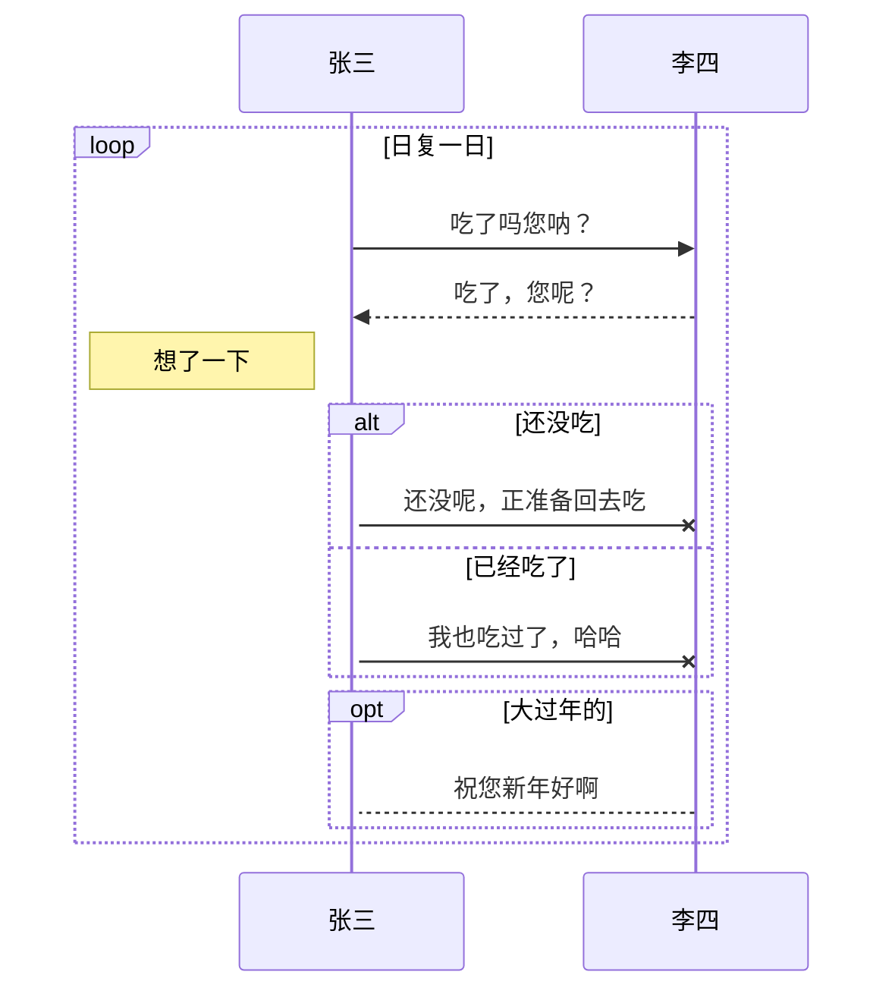
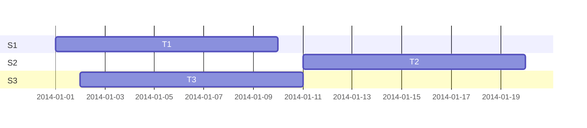
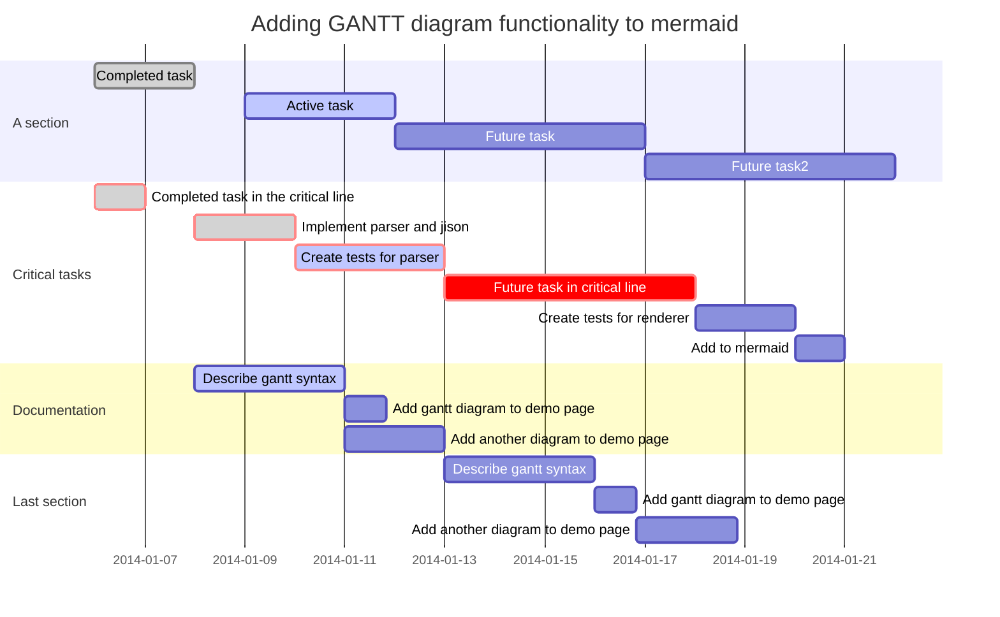

## 代码区域

三个反引号个（```）+编程语言即可

```text
//设置线程名字
thread.setName("线程1"); 
thread1.setName("线程2");
```

## 表格的使用

第一种：快捷键**Ctrl+T**

第二种：|ID|name|age|回车即可

## 水平分割线

```text
***或者- - -
```

## 超链接

- 使用快捷键Ctrl+K
- 使用2个反斜杠""，
  [百度][[https://www.baidu.com/](https://link.zhihu.com/?target=https%3A//www.baidu.com/)]

## 表格的使用

第一种：快捷键**Ctrl+T**

第二种：|ID|name|age|回车即可

| ID   | name | age  |
| ---- | ---- | ---- |
|      |      |      |

```text
>+空格
```

## 数学表达式

Typora支持加入用LaTeX写成的数学公式，并且在软件界面下用MathJax直接渲染，数学公式分为两种参考**[Mathpix Snip](https://link.zhihu.com/?target=https%3A//mathpix.com/)**

- 行内公式`$$`

  212$\sum$21212 $A$

  $x3$

- 行间公式 `$$ ... $$`,（或者$$+回车）
  $$
  \sum
  xy
  $$

```mermaid
```

# **图表是以````mermaid ` 开始的代码块。**

mermaid 美人鱼，是一个类似 markdown，用文本语法来描述文档图形 (流程图、 时序图、甘特图) 的工具，您可以在文档中嵌入一段 mermaid 文本来生成 SVG 形式的图形 比如插入下面的代码


### 图表方向

Mermaid 支持多种图表的方向，语法如下：

```
```mermaid ` 开始的代码块。**
    图表中的其他语句...
```

其中“方向描述”为

| 用词 | 含义     |
| :--- | :------- |
| TB   | 从上到下 |
| BT   | 从下到上 |
| RL   | 从右到左 |
| LR   | 从左到右 |

**从上到下**

AB

**从下到上**

AB

**从右到左**

AB

**从左到右**

AB

### 节点定义

即流程图中每个文本块，包括开始、结束、处理、判断等。Mermaid 中每个节点都有一个 id，以及节点的文字。

| 表述       | 说明           |
| :--------- | :------------- |
| id[文字]   | 矩形节点       |
| id(文字)   | 圆角矩形节点   |
| id((文字)) | 圆形节点       |
| id>文字]   | 右向旗帜状节点 |
| id{文字}   | 菱形节点       |

需要注意的是，如果节点的文字中包含标点符号，需要时用双引号包裹起来。

### 节点间的连线

| 表述     | 说明           |
| :------- | :------------- |
| >        | 添加尾部箭头   |
| -        | 不添加尾部箭头 |
| –        | 单线           |
| –text–   | 单线上加文字   |
| ==       | 粗线           |
| ==text== | 粗线加文字     |
| -.-      | 虚线           |
| -.text.- | 虚线加文字     |

### 子图表

使用以下语法添加子图表

```
subgraph 子图表名称
    子图表中的描述语句...
end
```

### 对 fontawesome 的支持

使用 `fa: #图表名称#` 的语法添加 fontawesome。

举个例子:




子图表普通线粗线虚线无箭头矩形菱形右向旗帜圆形圆角矩形

## 序列图

使用以下语法开始序列图

```
sequenceDiagram
    [参与者1][消息线][参与者2]:消息体
    ...
```

例如：



张三李四吃了吗？吃了张三李四

### 参与者

上例中的张三、李四都是参与者，上例中的语法是最简单的，也可以明显表明参与者有哪些:



### 消息线

| 类型 | 描述                       |
| :--- | :------------------------- |
| ->   | 无箭头的实线               |
| –>   | 无箭头的虚线               |
| ->>  | 有箭头的实线               |
| –>>  | 有箭头的虚线               |
| -x   | 末端为叉的实线（表示异步） |
| –x   | 末端为叉的虚线（表示异步） |

### 处理中

在消息线末尾增加 `+` ，则消息接收者进入当前消息的“处理中”状态；
在消息线末尾增加 `-` ，则消息接收者离开当前消息的“处理中”状态。

或者使用以下语法直接说明某个参与者进入“处理中”状态:

```
activate 参与者
```

### 标注

语法如下

```
Note 位置表述 参与者: 标注文字
```

其中位置表述可以为

| 表述     | 含义                       |
| :------- | :------------------------- |
| right of | 右侧                       |
| left of  | 左侧                       |
| over     | 在当中，可以横跨多个参与者 |

### 循环

语法如下

```
loop 循环的条件
    循环体描述语句
end
```

### 判断

```
alt 条件 1 描述
    分支 1 描述语句
else 条件 2 描述 # else 分支可选
    分支 2 描述语句
else ...
    ...
end
```

如果遇到可选的情况，即没有 else 分支的情况，使用如下语法：

```
opt 条件描述
    分支描述语句
end
```

### 举个例子

```
```



张三李四吃了吗您呐？吃了，您呢？想了一下还没呢，正准备回去吃我也吃过了，哈哈alt[ 还没吃 ][ 已经吃了 ]祝您新年好啊opt[ 大过年的 ]loop[ 日复一日 ]张三李四

## 甘特图(gantt)

甘特图是一类条形图，由Karol Adamiechi在1896年提出, 而在1910年Henry Gantt也独立的提出了此种图形表示。通常用在对项目终端元素和总结元素的开始及完成时间进行的描述。

示例：




```
gantt
dateFormat YYYY-MM-DD

section S1
T1: 2014-01-01, 9d

section S2
T2: 2014-01-11, 9d

section S3
T3: 2014-01-02, 9d
```

01/0601/1301/20T1T2T3S1S2S3

先看一个复杂的甘特图：




|      |      |
| :--- | :--- |
|      |      |
|      |      |
|      |      |
|      |      |
|      |      |
|      |      |
|      |      |
|      |      |